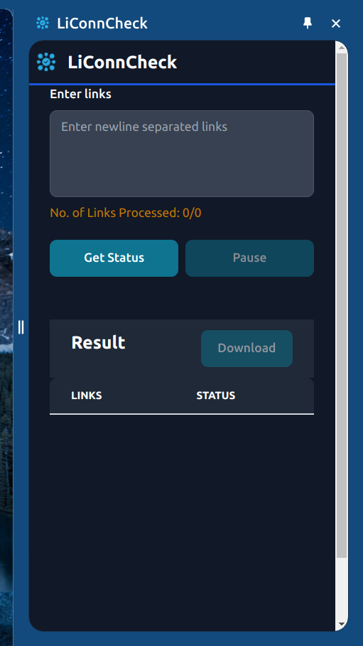

# LiConnCheck

A chrome extension to check linkedin connection status of sent linkedin connections in bulk from multiple user linkedin profile links.

## Tech Stack

**Tech:** React, TailwindCSS, Flowbite-React

## Screenshots

## Usage
To use the chrome extension

- Go to Manage extensions

- Enable developer mode from top right

- click on `Load Unpacked` button on top left

- Select the `dist` folder inside the project folder

- Pin the extension and click on the extension Icon
